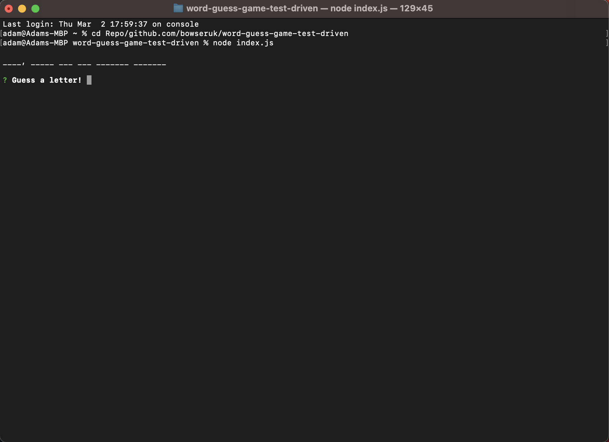

# Word Guess Game

## Description

A game to guess the word a letter at a time in node.js. This project is created with test driven development through Jest.js.

The project had the following requirements:

- The game plays with no errors.

- All the tests pass.

## Table of Contents

- [Description](#description)

- [Table of Contents](#table-of-contents)

- [Installation](#installation)

- [Usage](#usage)

- [Tests](#tests)

- [Credits](#credits)

- [License](#license)

- [Questions](#questions)

## Installation

Node.js must be installed for this project. See the link in the credits section to see how to install it. With it installed, open a terminal in the root of the cloned project. Use "npm install"  to install the dependencies. Then run "node index.js" to run the project.

## Usage

A screenshot of the project can be seen below:

Follow the installation steps above. Then run "node index.js" in a terminal on the root of the folder to run the project. press a letter at a time into the prompt.

## Tests

The project has the following tests:

- Jest tests run on a pull request or update to main.

- There is a set of tests for Letter.js

- There is a set of tests for Word.js

## Credits

The following resources were important for this project.

- [Readme Generator](https://github.com/bowseruk/readme-generator-nodejs) for generating the readme.

- [Chalk](https://github.com/chalk/chalk) was used for the terminal styling.

- This project was based on a mini-project by edX Boot Camps LLC.

- [W3School](https://www.w3schools.com/) was used as a reference for elements to use and good practice.

- [MDN](https://developer.mozilla.org/en-US/) is a very comprehensive and useful resource.

- [Stack Overflow](https://stackoverflow.com/) always seems to have the answer to a problem that occurs.

- [Node.js](https://nodejs.org/) was used in the project, following documentation from their site.

- [Jest.js](https://jestjs.io/) was used as a testing framework for the project, following documentation from their site.

## License

This project is licensed under the [MIT](https://opensource.org/licenses/MIT) license.

This full license used by the project is in the LICENSE file of the repo.

## Questions

Please contact me with any questions by:

- Github Discussion: Add a discussion or raise an issue on this repo.

- My Github Username is [BowserUK](https://github.com/bowseruk): Feel free to find more contact details or browse my other Repos.